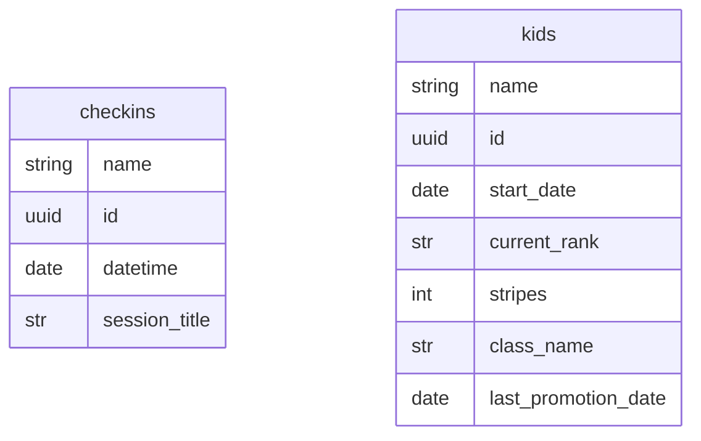

## Objectives

- To identify leads checking in for their first class in order to follow up with them
- Closely follow members attendance for promotions (based on check-in data) in order to boost retention by handing out timely promotions

## Skills

Python, SQL, DataBase design(SupaBase)

## Description

This project automates the extraction, transformation, and reporting of member attendance data from a PushPress dashboard.
It demonstrates how to build a full-stack data pipeline, leveraging automation, cloud database engineering, and interactive dashboards to generate actionable business insights. I originally used fastAPI to manage CRUD operations, but since I am hosting the app in render's free tier I had to use 2 services, which caused a delay. I opted to use SupaBase-py and keep everything in a single service.

## Outcome

- We were able to give promotions in a timely manner, aiding in the retention of members by up to 20%. This was measured using the PushPress app.
- We were able to convert more leads to permanent members, thanks to the direct approach after tracking them with the alert I set up.

---

# Detailed - Automated Attendance Pipeline & Dashboard

## Overview

This project automates the extraction, transformation, and reporting of member attendance data from a PushPress Looker dashboard.
It demonstrates how to build a full-stack data pipeline, leveraging automation, cloud database engineering, and interactive dashboards to generate actionable business insights. I originally used fastAPI to manage CRUD operations, but since I am hosting the app in render's free tier I had to use 2 services, which caused a delay. I opted to use SupaBase-py and keep everything in a single service.

## Skills used

Python, SQL, DataBase design(SupaBase)

## Key Features

- Automated scraping of an embedded dashboard (with secure login & filter selection)
- Parsing and storing clean data in Supabase (PostgreSQL)
- SQL views & triggers to transform and manage data
- Interactive web app in Shiny for real-time tracking of kids assistance and engagement
- Additional Looker dashboard to track new leads

## Full Workflow

```
flowchart LR
    A["Automated Scraper(Python + Playwright)"]
    B["Supabase(PostgreSQL)"]
    C["SQL Views & Triggers"]
    D["Shiny Web App"]
    E["Looker Dashboard"]
    PP["PushPress"]
    PP --> A
    A --> B
    B --> C
    C --> D
    C --> E
    D <--> B
```

## How it works:

1. Authenticate → filter → export fresh data automatically
2. Clean and push data to Supabase
3. Use views to filter kids vs. adults & identify new members
4. Triggers keep summary tables updated
5. Serve insights via Shiny and Looker dashboards

## Data Pipeline Highlights

- Automation: Playwright (Python) handles automatic login, filter selection, dynamic CSV exports, URL manipulation and API calls to SupaBase.
- Cloud Storage: Supabase Postgres stores all check-ins, sessions, and member details.
- Data Modeling: SQL views separate kids’ attendance and identify new kids for promotions.
- Business Logic: Triggers & functions automatically manage new lead and kids records.
- Reporting: Shiny dashboard for internal use, Looker for stakeholder reporting.

## Security & Best Practices

.env files used for API keys and credentials — never hardcoded.

## Tech Stack

| Layer            | Tool/Framework                      |
| ---------------- | ----------------------------------- |
| **Automation**   | Python, Playwright                  |
| **Data Storage** | Supabase (PostgreSQL)               |
| **Processing**   | SQL (views, triggers)               |
| **Reporting**    | Shiny, Looker Studio                |
| **Deployment**   | GitHub Actions, Supabase and Render |

## Impact

- Improved data accuracy & consistency by automating manual CSV exports
- Reduced admin effort for tracking kids’ promotions & new leads
- Better business insights with self-serve dashboards & real-time updates

## Repository Structure

```bash
├── daily_update.py/         # Scraper scripts
├── pushdata.py/             # Saving data to supabase
├── update_kids_shiny.py/    # Web app source code
├── main.py/                 # FastAPI
├── README.md
└── requirements.txt         # Packages
```

## What I Learned

- Building robust automation for web scraping with session handling.
- Using Supabase as a cloud data warehouse.
- Writing efficient SQL for real-time views and triggers.
- Combining open-source and SaaS BI tools for end-to-end reporting.

## SQL statements



**Inserting new kids record to kids table when needed**

```sql
CREATE TRIGGER insert_new_kid_trigger

AFTER INSERT ON checkins

FOR EACH ROW

EXECUTE FUNCTION insert_new_kid_if_needed();
```

```sql
BEGIN
  IF NEW.session_title in ('Youth Jiu Jitsu (Ages 8-14)', 'Youth Jiu Jitsu (Ages 4-8)') THEN
    IF NOT EXISTS (
      SELECT 1 FROM kids WHERE client = NEW.client
    ) THEN
      INSERT INTO kids (client, start_date)
      VALUES (NEW.client, DATE(NEW.checkin_datetime));
    END IF;
  END IF;
  RETURN NEW;
END;
```

**Add lead to report_summary**

```sql
CREATE or replace TRIGGER insert_checkins_trigger

AFTER INSERT ON checkins

FOR EACH ROW

EXECUTE FUNCTION update_report_summary();
```

```sql
BEGIN
  IF NEW."member_status" = 'lead' THEN
    INSERT INTO report_leads (
      client,
      member_status,
      session_datetime,
      session_type,
      session_category_name,
      session_title,
      plan_package
    )
    VALUES (
      NEW."client",
      NEW."member_status",
      NEW."session_datetime",
      NEW."session_type",
      NEW."session_category_name",
      NEW."session_title",
      NEW."plan_package"
    );
  END IF;
  RETURN NEW;
END;
```

**VIEW FOR SHINY WEB APP**

```sql
CREATE OR REPLACE VIEW kids_checkins_summary AS
with kids_table as (
  SELECT
    client,
    first_name,
    last_name,
    start_date,
    case
      when last_promotion_date is null then start_date else last_promotion_date
    end as last_promotion_date,
    current_rank,
    stripes,
    class
  FROM
    kids
)

SELECT
  k.*,
  COUNT(*) FILTER (WHERE c.checkin_datetime::date >= k.last_promotion_date::date) AS attendance_since_promotion
FROM
  kids_table as k
JOIN
  checkins c ON k.client = c.client
WHERE
  c.session_title in ('Youth Jiu Jitsu (Ages 4-8)', 'Youth Jiu Jitsu (Ages 8-14)')
GROUP BY
  k.client,
  k.first_name,
  k.last_name,
  k.start_date,
  k.last_promotion_date,
  k.current_rank,
  k.stripes,
  k.class;
```

## [Learn More about it!](https://github.com/cmurga95/chapelhillbjj)
