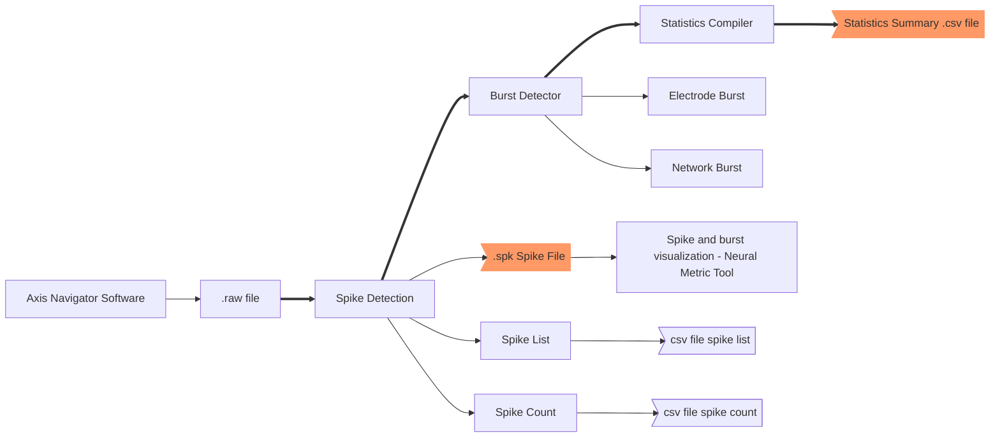

## Summary

My work as a Research Technician at the University of North Carolina involved working with Multi Electrode Array (MEA). This is a technique to measure electrical activity from neurons. Work consisted in cleaning, merging and visualization of this in an organized and accurate manner.
This is an over all workflow:

## Objectives

- To develop a data analysis pipepline to facilitate data analysis and visualization
- To find optimal parameters for spike detection that minimize false positives

## Tools and skills used

### Tools

Python (Pandas, Dask, Numpy, Seaborn, Matplotlib), Excel

### Skills

Problem solving, feature extraction, data wrangling

## Challenges

One of the biggest challenge was to catch up with literature and getting familiar with the whole process. It was a lot of fun regardless.
Another challenge (more technical) was dealing with the vast amount of data, I overcome this by vectorizing operations, optimizing my code and leveraging other libraries such as dask.

## Outcome

This workflow reduced times by as much as 90%. Doing this manually was very tedious and time consuming. Automation not only improved the quality of the analysis but it also validated the data and we were able to do visualizations and diagnose potential problems.

---

# More details below :\)\)

# Data Acquisition

The Data Acquisition step consisted in reading electrical activity of a plate.
Below is an example of a plate

From which many files are generated (see below). The file we are the most interested in is the **Statistics Summary**. It contained a summary of the behavior of the plate for each well in terms of several metrics (Mean Firing Rate, Number of Spikes, Average Spikes per Burst, Std spikes per Bursts, etc.).

# Clean and Merge Files

I wrote a Python script to do this automatically.

# My contribution

- Automation of the extraction and visualization of reports
- I noticed they were not using the correct parameters to detect spikes, this lead to misleading conclusions. I proposed a different approach.
- Validation of Spikes

## Spike Detector

Setting a proper detection threshold is crucial for accurate neural data analysis. Lower thresholds increase the incidence of false-positives (small noise events misidentified as spikes); higher thresholds may not detect smaller amplitude action potentials. Axion recommends an adaptive threshold of 6 x standard deviations to minimize both false-positives and missed detections.
**Adaptive Threshold**: Threshold is set on a per electrode basis, as multiple of the noise of the continuous data.
**Detect Only Crossings**: requires the signal to return below threshold before detecting an additional spike.

# Why Fixed Thresholds Fail

## _Problem_

- A fixed threshold (e.g., 5 µV) ignores **electrode-specific noise**:
  - **False positives**: Noisy channels misclassify noise as spikes.
  - **False negatives**: Quiet channels miss low-amplitude spikes.

**_The images below are created from synthetic data for demonstration purposes_**

### 2uV noise

### 4 uV noise

### 8 uV noise

## Spike Validation

## Extraction of Spike Windows to validate visually

A strategy to validate the spikes is to first take a spike waveform that we visually validate and reconstruct a wavelet based on the frequencies of said spike. Or take a spike that already looks like the spike wavelet.

But first, denoising the signal will improve the results. For this, we use the Teager Energy Operator and reconstruct each spike, after this use the wavelet

It would be wise (for computing reasons) to only use N number of samples, we could take Week Number 3 to run the validation protocol and exclude noisy electrodes or with poor validation scores.

## Sample size calculation

The N number of samples would be calculated as followed:

### Population size

We know the total number of spikes per electrode, this would be our population size per electrode.

### Margin of Error (Confidence Interval)

This percentage indicates how much our sample results may deviate from the true population value

### Confidence Level

This would reflect how confident we want to be that the true population parameter lies within the margin of error that we set.
Common levels are:

| Level | Z-Score |
| ----- | ------- |
| 90%   | 1.645   |
| 95%   | 1.96    |
| 99%   | 2.576   |

### Sample size

$$n=\frac{z^2 \cdot p \cdot (1 - p)}{e^2}$$
p = population proportion

e = margin of error

z = z score associated with confidence level

##### For finite populations (like ours)

If total number of spikes (N) is known and relatively small (e.g., <100,000), adjust the sample size:

$$n=\frac {n_{0}}{1+\frac{(n_{0}−1)}{N}}$$
​This prevents oversampling when N is small.

**Important note, spikes selected must be random**

### Teager Energy Operator

It calculates the energy of a signal
For this we should find signals where spikes are NOT present

For discrete signals:

$$x(n)=\frac{x(n)^2−x(n−1)x(n+1))}{T^2}$$
Assumption of T = 1

But we can also use $$1/fs$$

##### Implementation to denoise signal

1. Find a time where a signal is not present (e.g. It is pure noise) for each electrode (take 3 random spikes and use 1 ms before and 1 ms after, we can validate visually).
2. We assume that this noise is stationary (doesn't change overtime) and use this TEO (calculated on a per electrode basis) for each own electrode (if we want to validate each weeks readings we need to re-calculate for each reading, because noise can vary)
3. Based on this we clean each previously selected spike and reconstruct a clean spike.
4. Move to SWT

### Frequency Spectrum Analysis

By deconstructing the signal in its frequency spectrum, we can determine if a signal is noise or a real expected signal from a neuron.

FFT has low temporal resolution, another option is to run the analysis using Stationary Wavelet Transform, which extends the Fourier transform to have better temporal resolution.

SWT is decomposed into Low frequency Component (A) and the high frequency component (D).
If we take the signal power ratio (D/A), we want to have a _high_ signal to noise ratio. Based on this, we can then build a threshold and determine real signals from noise.
